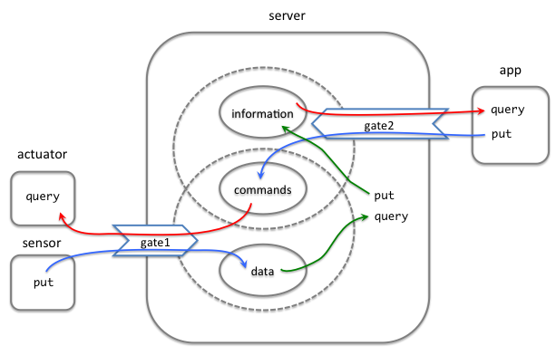

This document provides some technical guidelines on the implementation of pSpaces. It is particularly meant for those willing to implement support for a new language. The key idea of the programming model is to support interaction by adding and retrieving tuples from local and remote spaces. Programs and spaces can be located in any device. All spaces support the same minimal API and interaction protocols.
 
## Local Spaces
A space is is a collection of tuples supporting a simple API described below. Whenever possible the interface or abstract data type used for specify the API of spaces should be called `Space`.

## Space API
Spaces should implement an interface that supports several operations. Every implementation must support the core API specified below. Other operations may be supported.

### Core Space API
All spaces must implement the following operations:
- `put(t)` adds a tuple `t` to a space. 
- `get(T)` blocks until a tuple is found in the space which matches the template `T`. It then returns the matched tuple and removes it from the space. 
- `getp(T)` is the non-blocking version of `get`. In addition to the matching tuple, it returns whether the operation was successful or not.
- `getAll(T)` is a non-blocking operation that returns all tuples matching the template `T` and removes them from the space.
- `query(T)` is the non-destructive version of `get`. The operation blocks until a tuple is found in the space which matches the template `T`. It then returns the matched `tuple` and removes it from the space. 
- `queryp(T)` is the non-blocking version of query. In addition to the matching tuple, it returns whether the operation was successful or not.
- `queryAll(T)` is the non-destructive version of `getAll`.

All the above operations may fail (e.g. due to communication errors or denied access) and must return a value stating indicating success or failure.

The core API intentionally underspecifies the behaviour of simple retrieval operations (`get`, `getp`, `query` and `queryp`). However, the following implementations should obey to the behaviour specified below:
- `SequentialSpace`: retrieval operations return the oldest matching tuple. 
- `QueueSpace`: retrieval operations return the oldest tuple, if it matches the specified template.
- `StackSpace`: retrieval operations must return the newest tuple, if it matches the specified template.
- `PileSpace`: retreival operations must return the newest matching tuple.
- `RandomSpace`: retrival operations return any matching tuple, chosen according to a random choice with uniform distribution (equally likelihood of getting any tuple).

All implementations should provide at least the `SequentialSpace` implementation. The rest are optional. 

As a side note, `SequentialSpace` are similar to message channels in Promela, `FifoSpace` amounts to unbounded FIFO channels (with testing in addition to read operations) and `LifoSpace` provides a stack-based space.

 
A space can be accessed locally as an ordinary data structure and can hence offer a local API. Spaces can be accessed remotely and should hence support a remote API. Whenever possible, a wrapper for remote spaces should be offered to support a uniform access to spaces. 

## Space repositories and space gates




To make a space accessible to other applications, the space must be part of a space repository and that repository must be associated to at least one gate. The above figure illustrates these concepts with an example. Applications are represented as rounded boxes. The `server` application coordinates an application `app` which offers an interface to monitor the `sensor` of a device and control its `actuator`. The application `server` has three spaces (denoted with ovals): `information`, `commands` and `data`. The spaces `information` and `commands` belong to the uppermost repository (denoted with a dashed oval) is accessible though gate `gate1`. This is the gate that the `app` uses to retrieve information from the sensor and to insert new commands. The space `command` is also part to the bottom repository, which has a gate `gate2`. This gate is used by the `sensor` to provide raw data to the `server` and by the `actuator` to obtain new commands from the `server`. 

A space can be dynamically associated to none to several repositories. The notion of repository eases the management and sharing of access points (gates) to spaces. A space that is not associated to a repository can only be accesses by the application that created it. Associating a space with more than one repository is useful in scenarios like the above one, where some spaces need to be made available on two networks (say the Internet for `gate1` and a local network for `gate2`) where other spaces need to be confined to just one of the networks. Similar scenarios can arise if one wants to provide gates with different properties with respect to security or performance. It is worth to remark that any space can be added to a repository, including remote spaces.   

The data structure for space repositories should be named `SpaceRepository`. A space repository can be dynamically associated to zero or more spaces, and a space can be associated to zero or more repositories. Similarly, a space repository can be associated with zero or more gates. A gate can be associated to zero or more repositories. 

Space repositories should support the following operations:
- a constructor, with no parameters.
- `addSpace(spaceId,space)`: this operation associates a space `space` to the repository, under the name `spaceId`. If the `spaceId` has been already added, an error or exception is returned.
- `delSpace(spaceId)`: this operation dissasociates a space identifier `spaceId` from the repository. There is no effect if the space does not exist or if it is not associated to the repository. If a space is associated with other identifiers, it remains associated to the repository with those identifiers.
- `addGate(gate)`: this operation associates a gate to the repository. The gate is created if it does not exist. There is no effect if the gate is already associated to the gate.
- `delGate(gate)`: this operation dissasociates a space from the repository. There is no effect if the gate is not associated to the repository.

A gate is just an access point than application opens to provide access to the spaces it hosts. Each gate is specified by an URI with the following format:
 
`<protocol>://<host>[:<port>][?<mode>]`
 
where
- `protocol` is the protocol used for the communication. The default value is `tcp`, and must be supported.
- `host` is the name or ip address of the host where the space is located. 
- `port` is a port number. The default value is 31415.
- `mode` specifies an interaction protocol (described below). The options are `KEEP`, `CONN`, `PUSH` and `PULL`. The default value is `KEEP`.
 
As an example, a user should be able to create a space repository at `coolspaces.com` with two spaces `data` and `messages` in an object-oriented language with code along the lines of:
 
```java
SpaceRepository repository = new SpaceRepository();
repository.addGate("coolspaces.com:1234?CONN");
repository.addSpace("data",new SequentialSpace());
repository.addSpace("messages",new SequentialSpace());
```

Remote spaces are addressed with a space address, which is an URI of the format
 
`<protocol>://host[:port]/<space_name>[?<connectiontype>]`
 
The format is very much like that of gates, but with name of the space.
 
In our example, a programmer should be able to access the spaces created above with code along the lines of

```java
Space data = new RemoteSpace("coolspaces.com:1234/data?CONN");
Space messages = new RemoteSpace("coolspaces:1234/messages?CONN");
```

assuming a wrapper `RemoteSpace` is supported.
 
## Agents
Programs interacting with local or remote spaces are often called agents in this documentation. Agents need not be implemented as a first class concept in the host programming language and can correspond to any form of behaviour encapsulation provided by the host programming language (routines, threads, programs, activities, objects, ...). If you decide to implement agents as a first-class structure, the name `Agent` should be preferred.

## Protocol for operations on remote spaces

### CORE Protocol

The protocols used to access remote spaces are based on a simple request/response pattern:

  `A ---[request]--> B`

  `A <--[response]-- B`

Party `A` is the one willing to perform the operation on `B`. `A` initiates the protocol and indicates which specific protocol it wants to use (see message format below). The options are `KEEP`, `CONN`, `PUSH` and `PULL`.

When `KEEP` is used the connection is persistent. When method `CONN` is used, only one connnection is used and the request and its response are exchanged in the same connection. When `PUSH` is used, the two messages are exchanged in two separate connections: the first opened by `A` and the second opened by `B`. Finally, in `PULL` mode, a connection is used for each time party `A` tries to get a response from party `B`.

The correlation between requests and response is based on session identifiers (see below). Requests and responses are messages serialised in JSON format and their content depends on the kind of request/response.

### Put requests

Put requests have the following format

`{ "mode": mode_code, "action": "PUT_REQUEST", "source" : source, "session": session, "target": target, "tuple" : tuple }`

where 
- `mode` is the code identifying the actual protocol.
- `source` is a port that identifies the requester.
- `session` is an integer that uniquely identifies the request on the source side (if mode is `CONN` this field is optional).
- `target` identifies the target space with a global identifier.
- `tuple` is the tuple, represent as a json list, that should be added.

### Put responses

`{ "action": "PUT_RESPONSE", "source" : source, "session": session, "target": target, "code" : code , "message": message }`

where 
- `source` identifies the original requester.
- `session` is a unique session identifier used by the source to distinguish requests.
- `target` is a global identifier that identifies the target space.
- `code` is an HTTP like return code.
- `message` is a string providing additional information related to the return code.

### Get[p/all]/Query[p/all] requests

Get requests have the following format

`{ "mode": mode_code, "action": response, "source" : source, "session": session, "target": target, "template" : template }`

where 
- `mode' is the code identifying the actual protocol.
- `response` is one of `GET_RESPONSE`, `GETP_RESPONSE`, `GETALL_RESPONSE`, `QUERY_RESPONSE`, `QUERY_RESPONSE`, `QUERYALL_RESPONSE`.
- `source` identifies the requester.
- `session` is a unique session identifier used by the source to distinguish requests (if mode is `CONN` this field is optional).
- `target` is a global identifier that identifies the target space.
- `template` is the template to be considered.

### Get/Query  responses

`{ "action": request, "source" : source, "session": session, "target": target, "result":result , "code" : code , "message": message }`

where 
- `request` is one of `GET_RESPONSE`, `GETP_RESPONSE`, `GETALL_RESPONSE`, `QUERY_RESPONSE`, `QUERY_RESPONSE`, `QUERYALL_RESPONSE`.
- `source` identifies the original requester.
- `session` is a unique session identifier used by the source to distinguish requests.
- `target` identifies the target space.
- `success` is a return code (see below).
- `result` contains the result of the operation (if successful) as a list of tuples.
- `code` is an HTTP like return code.
- `message` is a string providing additional information related to the return code.

## Adhere to the following guidelines to structure your project
Instructions coming soon...

## Document your project :)
